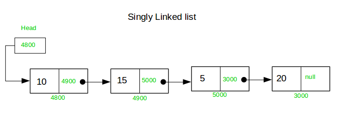

# Singly Linked List in Go


This repository contains a simple implementation of a singly linked list in Go. It includes basic operations such as insertion, deletion, and printing of the list.

## Features

- Insert a new node at the end of the list
- Delete a node by value
- Print the entire list

## Installation

Clone the repository:

```bash
git clone https://github.com/RoshanShrestha123/singly-linked-list-go
cd singly-linked-list-go
